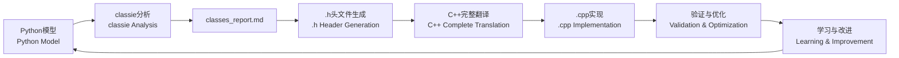

# Py2Cpp4OR

智能Agent，用于将Python优化模型（gurobipy/pyomo）翻译为高效的C++代码，具备迭代学习能力。

Intelligent agent for translating Python optimization models (gurobipy/pyomo) to efficient C++ code, with iterative learning capabilities.

## 项目背景 | Background

**问题 | Problem**: 大规模运筹优化问题中，Python建模耗时过长（100秒以上）。虽然存在其他方案（HPC分布式计算、Cython），但C++能带来显著加速（<1秒），且符合导师技术栈。

Python model building is too slow for large-scale OR problems (100s+ for model construction). While alternatives exist (HPC distributed computing, Cython), C++ offers dramatic speedup (<1s) and aligns with supervisor's expertise.

**挑战 | Challenge**: 初期AI生成的C++代码过于复杂，难以审查，存在潜在错误风险。本项目旨在构建可靠的Agent，生成简洁、稳定、安全的C++代码。

Initial AI-generated C++ code is overly complex, difficult to review, and potentially error-prone. This project aims to build a reliable agent that produces simple, stable, and safe C++ code.

## 项目目标 | Purpose

建立可控的翻译框架 | Create a controlled translation framework that:
- 生成简洁的C++代码（仅.cpp和.h文件） | Generates clean, minimal C++ code (only .cpp and .h files)
- 保持代码可读性，便于人工审查 | Maintains code readability for human review
- 从反馈中学习，持续优化翻译质量 | Learns from feedback to improve translation quality
- 连接Python原型开发与C++生产部署 | Bridges Python prototyping and C++ production

## Python → C++ 关键差异 | Key Python → C++ Differences

### 数据导入：readline方法 | Data I/O: readline Approach
**Python**: 高级库（pandas/numpy） | High-level libraries (pandas/numpy)  
**C++**: 原生`ifstream`逐行读取 | Raw `ifstream` line-by-line reading

**为什么用"笨"方法 | Why "simple" approach**:
- 透明可控，便于调试 | Transparent and debuggable
- 无外部依赖（避免Eigen/Armadillo） | No external dependencies
- 符合导师代码风格 | Matches supervisor's coding style
- 完全控制数据解析 | Full control over data parsing

### 头文件（.h） | Header Files (.h)
**Python**: 类定义和实现一起 | Class definition and implementation together  
**C++**: 声明(.h)和实现(.cpp)分离 | Separated declaration (.h) and implementation (.cpp)

**分离的目的 | Purpose of separation**:
- 接口文档 | Interface documentation
- 编译效率（修改.cpp不需重编译依赖者） | Compilation efficiency
- 通过header guard避免重复定义 | Prevent duplicate definitions

## 架构设计 | Architecture

**迭代学习框架 | Iterative Learning Framework:**
```
agent.md → 执行 | Execute → reasoning_traces/ → 反馈 | Feedback → learning_log.md → 更新 | Update agent.md
```

**仓库结构 | Repository Structure:**
```
.
├── agent.md              # Agent操作规范（LLM上下文） | Agent operational rules (LLM context)
├── learning_log.md       # 经验总结与差距分析 | Experience summary & gap analysis
├── reasoning_traces/     # 精炼的决策日志 | Distilled decision logs
├── classes_report.md     # 类结构分析与报告 | Class structure analysis & reports
├── USER_GUIDE.md         # 用户数据准备指南 | User data preparation guide
├── CLAUDE.md             # Claude Code使用指导 | Claude Code usage guidance
├── .claude/agents/       # 专门化Agent配置 | Specialized agent configurations
│   ├── classie.md        # 类分析专家Agent (purple/Sonnet) | Class analysis expert agent
│   └── heady.md          # 代码生成专家Agent (blue/Sonnet) | Code generation expert agent
├── examples/             # Python-C++翻译对照 | Python-C++ translation pairs
├── tests/                # 验证案例 | Validation cases
└── *.h                   # 生成的C++头文件 | Generated C++ header files
```

## 当前进展 | Current Status

### ✅ 完成的里程碑 | Completed Milestones

**智能Agent系统 | Intelligent Agent System:**
- ✅ **专门化Agent团队**: 部署分析师(Classie/purple)和代码生成师(Heady/blue)的协作 | Specialized Agent Team: Deploy collaboration between analyst (Classie/purple) and code generator (Heady/blue)
- ✅ **Agent配置**: 完整的Agent配置文件，指定模型(Sonnet)、功能和颜色标识 | Agent Configuration: Complete agent configuration files specifying model (Sonnet), functions, and color identifiers
- ✅ **职责分离**: 分析专注于实体识别，生成专注于代码实现 | Responsibility Separation: Analysis focuses on entity identification, generation focuses on code implementation
- ✅ **结构化工作流**: 从Python模型到C++头文件的完整自动化流程 | Structured Workflow: Complete automated workflow from Python models to C++ header files

**Classie Agent (分析师) | Classie Agent (Analyst):**
- ✅ **模式识别**: 识别共享索引的数组、DataFrame、字典结构 | Pattern Recognition: Identify arrays sharing indices, DataFrames, dictionary structures
- ✅ **实体检测**: 自动识别节点、设施、资源、场景等逻辑实体类型 | Entity Detection: Automatically identify logical entity types like nodes, facilities, resources, scenarios
- ✅ **验证规则**: 每个类≥2个相关属性，代表逻辑实体类型 | Validation Rules: Each class has ≥2 related attributes, representing logical entity types
- ✅ **结构化输出**: 生成包含标量/数组成员分类的详细markdown报告 | Structured Output: Generate detailed markdown reports with scalar/array member classification

**Heady Agent (代码生成师) | Heady Agent (Code Generator):**
- ✅ **类型选择**: 容量/计数→int，成本/排放→double，索引→int | Type Selection: Capacity/Count → int, Cost/Emissions → double, Indices → int
- ✅ **命名规范**: 简洁明了(varCost, emsTrToSP, railMaintCostToDry) | Naming Convention: Concise but clear (varCost, emsTrToSP, railMaintCostToDry)
- ✅ **变量组织**: 按类别分组，包含完整初始化 | Variable Organization: Grouped by category with complete initialization
- ✅ **内存管理**: 指针初始化为nullptr，完整的init/delArr模式 | Memory Management: Pointer initialization to nullptr, complete init/delArr patterns
- ✅ **方法生成**: 一致的get/set模式和参数命名 | Method Generation: Consistent get/set patterns and parameter naming

**C++代码生成 | C++ Code Generation:**
- ✅ **头文件模板**: 验证标准化的.h文件模板，包含完整内存管理 | Header File Templates: Validated standardized .h file templates with complete memory management
- ✅ **类设计哲学**: 确立标量vs数组成员分离的设计原则 | Class Design Philosophy: Established design principles separating scalar vs array members
- ✅ **自动生成**: 实现基于分析的C++头文件自动生成 | Automatic Generation: Achieved analysis-based automatic C++ header file generation

**模型分析能力 | Model Analysis Capability:**
- ✅ **复杂模型支持**: 成功分析多周期、多场景的随机优化模型 | Complex Model Support: Successfully analyzed multi-period, multi-scenario stochastic optimization models
- ✅ **实体识别**: 自动识别和分类优化模型中的实体类型 | Entity Identification: Automatically identify and classify entity types in optimization models
- ✅ **命名优化**: 建立简洁一致的类命名规范 | Naming Optimization: Established concise and consistent class naming conventions

### 🔄 进行中的工作 | In Progress

- 🔄 **头文件完善**: 完成所有识别类的头文件生成 | Header File Completion: Complete header file generation for all identified classes
- 🔄 **模型集成**: 将生成的类结构整合到完整的C++优化模型中 | Model Integration: Integrate generated class structures into complete C++ optimization models

### 🎯 下一步目标 | Next Steps

- 🎯 **端到端翻译**: 实现Python模型到C++代码的完整自动化翻译 | End-to-End Translation: Achieve complete automated translation from Python models to C++ code
- 🎯 **性能验证**: 验证C++代码的性能提升效果 | Performance Validation: Verify performance improvement effects of C++ code
- 🎯 **学习能力**: 持续优化agent的模型识别和代码生成能力 | Learning Capability: Continuously optimize agents' model recognition and code generation capabilities

## 工作流程 | Workflow

### 增强的协作流程 | Enhanced Collaborative Workflow



1. **模型分析 | Model Analysis**: classie agent分析Python模型，识别实体类 | classie agent analyzes Python models to identify entity classes
2. **报告生成 | Report Generation**: 生成详细的classes_report.md分析报告 | Generate detailed classes_report.md analysis reports
3. **头文件创建 | Header Creation**: 基于分析自动生成完整的.h文件 | Automatically generate complete .h files based on analysis
4. **C++翻译 | C++ Translation**: 使用生成的头文件完成完整的C++实现 | Use generated headers to complete C++ implementation
5. **记录与学习 | Record & Learn**: 记录关键决策，提炼最佳实践 | Record key decisions and distill best practices
6. **持续改进 | Continuous Improvement**: 基于反馈优化agent能力 | Optimize agent capabilities based on feedback

### Agent协作机制 | Agent Collaboration

**主Agent (agent.md) | Main Agent (agent.md)**:
- 负责整体翻译策略和C++代码生成 | Responsible for overall translation strategy and C++ code generation
- 协调Classie和Heady的工作流程 | Coordinate Classie and Heady workflows
- 维护项目编码标准和最佳实践 | Maintain project coding standards and best practices

**Classie Agent (分析师 - purple/Sonnet) | Classie Agent (Analyst - purple/Sonnet)**:
- 专门负责Python模型的结构分析 | Specialized in Python model structural analysis
- 识别实体类型和属性关系 | Identify entity types and attribute relationships
- 生成结构化的`classes_report.md`分析报告 | Generate structured `classes_report.md` analysis reports
- 应用验证规则确保类的逻辑性 | Apply validation rules to ensure class logicality

**Heady Agent (代码生成师 - blue/Sonnet) | Heady Agent (Code Generator - blue/Sonnet)**:
- 专门负责C++头文件(.h)的生成 | Specialized in C++ header file (.h) generation
- 应用项目编码标准和模板 | Apply project coding standards and templates
- 确保内存安全和代码质量 | Ensure memory safety and code quality
- 生成完整的getter/setter模式 | Generate complete getter/setter patterns

**协作接口 | Collaboration Interface**:
- **Classie → Heady**: 通过`classes_report.md`传递分析结果 | Pass analysis results through `classes_report.md`
- **Heady → 主Agent**: 生成标准化的.h文件供C++实现使用 | Generate standardized .h files for C++ implementation
- **质量保证**: 各Agent都有独立的验证清单 | Quality Assurance: Each agent has independent validation checklists
- **持续改进**: 通过反馈循环优化各Agent能力 | Continuous Improvement: Optimize agent capabilities through feedback loops

## 设计理念 | Philosophy

本仓库存储精炼的知识，作为每日进展追踪工具。本地开发（Cursor/Claude Code/Codex）处理实验性工作；GitHub保存提炼的最佳实践。

This repository stores refined knowledge and serves as daily progress tracker. Local development (Cursor/Claude Code/Codex) handles experimentation; GitHub contains the distilled best practices.

### 核心创新 | Core Innovation

**智能Agent协作系统 | Intelligent Agent Collaboration System:**
- **专门化分工**: Classie(分析师)专注结构分析，Heady(代码师)专注头文件生成，主agent专注翻译实现 | Specialized Division: Classie (analyst) focuses on structural analysis, Heady (coder) focuses on header generation, main agent focuses on translation implementation
- **Agent配置化**: 完整的Agent配置体系，指定模型、颜色标识和专门功能 | Agent Configuration: Complete agent configuration system specifying models, color identifiers, and specialized functions
- **结构化学习**: 通过classes_report.md积累模型识别经验 | Structured Learning: Accumulate model recognition experience through classes_report.md
- **模板化生成**: 标准化的.h文件模板确保代码一致性 | Template-based Generation: Standardized .h file templates ensure code consistency
- **质量保证**: 每个Agent都有独立的验证清单和质量标准 | Quality Assurance: Each agent has independent validation checklists and quality standards
- **迭代改进**: 从每个翻译案例中学习并优化各Agent能力 | Iterative Improvement: Learn and optimize agent capabilities from each translation case

**类设计哲学 | Class Design Philosophy:**
- **实体中心**: 每个类代表优化模型中的逻辑实体 | Entity-centric: Each class represents a logical entity in optimization models
- **标量vs数组**: 标量成员属于节点自身，数组成员表示与其他节点的关系 | Scalar vs Array: Scalar members belong to the node itself, array members represent relationships with other nodes
- **索引即身份**: 数组索引代表目标节点的身份 | Index as Identity: Array indexes represent the identity of target nodes
- **内存安全**: 完整的init/delArr内存管理模式 | Memory Safety: Complete init/delArr memory management pattern

## 技术栈 | Technology Stack

- **分析引擎**: Claude Code + classie Agent | Analysis Engine: Claude Code + classie Agent
- **建模框架**: Pyomo → C++ (手工优化) | Modeling Framework: Pyomo → C++ (manually optimized)
- **数据I/O**: ifstream readline方法（无外部依赖） | Data I/O: ifstream readline method (no external dependencies)
- **内存管理**: 手动new/delete（符合项目标准） | Memory Management: Manual new/delete (project standard compliant)
- **编译器**: 标准C++11兼容 | Compiler: Standard C++11 compatible

## 开源协议 | License

Apache-2.0 license
