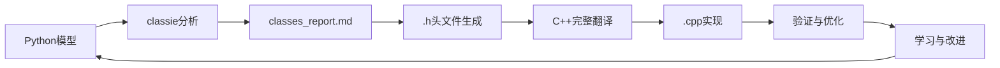

# Py2Cpp4OR

智能Agent，用于将Python优化模型（gurobipy/pyomo）翻译为高效的C++代码，具备迭代学习能力。

Intelligent agent for translating Python optimization models (gurobipy/pyomo) to efficient C++ code, with iterative learning capabilities.

## 项目背景 | Background

**问题 | Problem**: 大规模运筹优化问题中，Python建模耗时过长（100秒以上）。虽然存在其他方案（HPC分布式计算、Cython），但C++能带来显著加速（<1秒），且符合导师技术栈。

Python model building is too slow for large-scale OR problems (100s+ for model construction). While alternatives exist (HPC distributed computing, Cython), C++ offers dramatic speedup (<1s) and aligns with supervisor's expertise.

**挑战 | Challenge**: 初期AI生成的C++代码过于复杂，难以审查，存在潜在错误风险。本项目旨在构建可靠的Agent，生成简洁、稳定、安全的C++代码。

Initial AI-generated C++ code is overly complex, difficult to review, and potentially error-prone. This project aims to build a reliable agent that produces simple, stable, and safe C++ code.

## 项目目标 | Purpose

建立可控的翻译框架 | Create a controlled translation framework that:
- 生成简洁的C++代码（仅.cpp和.h文件） | Generates clean, minimal C++ code (only .cpp and .h files)
- 保持代码可读性，便于人工审查 | Maintains code readability for human review
- 从反馈中学习，持续优化翻译质量 | Learns from feedback to improve translation quality
- 连接Python原型开发与C++生产部署 | Bridges Python prototyping and C++ production

## Python → C++ 关键差异 | Key Python → C++ Differences

### 数据导入：readline方法 | Data I/O: readline Approach
**Python**: 高级库（pandas/numpy） | High-level libraries (pandas/numpy)  
**C++**: 原生`ifstream`逐行读取 | Raw `ifstream` line-by-line reading

**为什么用"笨"方法 | Why "simple" approach**:
- 透明可控，便于调试 | Transparent and debuggable
- 无外部依赖（避免Eigen/Armadillo） | No external dependencies
- 符合导师代码风格 | Matches supervisor's coding style
- 完全控制数据解析 | Full control over data parsing

### 头文件（.h） | Header Files (.h)
**Python**: 类定义和实现一起 | Class definition and implementation together  
**C++**: 声明(.h)和实现(.cpp)分离 | Separated declaration (.h) and implementation (.cpp)

**分离的目的 | Purpose of separation**:
- 接口文档 | Interface documentation
- 编译效率（修改.cpp不需重编译依赖者） | Compilation efficiency
- 通过header guard避免重复定义 | Prevent duplicate definitions

## 架构设计 | Architecture

**迭代学习框架 | Iterative Learning Framework:**
```
agent.md → 执行 | Execute → reasoning_traces/ → 反馈 | Feedback → learning_log.md → 更新 | Update agent.md
```

**仓库结构 | Repository Structure:**
```
.
├── agent.md              # Agent操作规范（LLM上下文） | Agent operational rules (LLM context)
├── learning_log.md       # 经验总结与差距分析 | Experience summary & gap analysis
├── reasoning_traces/     # 精炼的决策日志 | Distilled decision logs
├── classes_report.md     # 类结构分析与报告 | Class structure analysis & reports
├── USER_GUIDE.md         # 用户数据准备指南 | User data preparation guide
├── CLAUDE.md             # Claude Code使用指导 | Claude Code usage guidance
├── .claude/agents/       # 专门化Agent配置 | Specialized agent configurations
│   └── classie.md        # 类分析专家Agent | Class analysis expert agent
├── examples/             # Python-C++翻译对照 | Python-C++ translation pairs
├── tests/                # 验证案例 | Validation cases
└── *.h                   # 生成的C++头文件 | Generated C++ header files
```

## 当前进展 | Current Status

### ✅ 完成的里程碑 | Completed Milestones

**智能Agent系统 | Intelligent Agent System:**
- ✅ **classie Agent**: 专门化类分析专家，自动识别Python模型中的实体类
- ✅ **classes_report.md**: 完整的类结构分析报告，包含5个核心类定义
- ✅ **Agent协作框架**: agent.md与classie.md的无缝协作机制

**C++类设计 | C++ Class Design:**
- ✅ **Cities类**: 已验证的cities1.h模板，包含完整的内存管理
- ✅ **Term类**: 新生成的Term.h，用于传统内陆终端
- ✅ **设计哲学**: 标量vs数组成员的正确分离，数组索引代表节点身份

**随机优化模型分析 | Stochastic Model Analysis:**
- ✅ **models_stochastic.py**: 完整分析多周期、多场景随机优化模型
- ✅ **5个核心类**: Cities, Term, DryEx, DryNew, Sea的完整属性定义
- ✅ **命名优化**: 简化类名（Customer→Cities, ConventionalTerminal→Term等）

### 🔄 进行中的工作 | In Progress

- 🔄 **剩余头文件生成**: DryEx.h, DryNew.h, Sea.h的生成
- 🔄 **模型集成**: 将生成的类整合到完整的C++优化模型中

### 🎯 下一步目标 | Next Steps

- 🎯 **完整翻译**: 基于生成的头文件完成完整的Python→C++翻译
- 🎯 **性能验证**: 测试C++代码的性能提升（目标：<1秒 vs Python 100秒+）
- 🎯 **Agent学习能力**: 验证classie从新模型中学习并改进的能力

## 工作流程 | Workflow

### 增强的协作流程 | Enhanced Collaborative Workflow



1. **模型分析 | Model Analysis**: classie agent分析Python模型，识别实体类
2. **报告生成 | Report Generation**: 生成详细的classes_report.md分析报告
3. **头文件创建 | Header Creation**: 基于分析自动生成完整的.h文件
4. **C++翻译 | C++ Translation**: 使用生成的头文件完成完整的C++实现
5. **记录与学习 | Record & Learn**: 记录关键决策，提炼最佳实践
6. **持续改进 | Continuous Improvement**: 基于反馈优化agent能力

### Agent协作机制 | Agent Collaboration

- **主Agent (agent.md)**: 负责整体翻译策略和C++代码生成
- **classie Agent**: 专门负责类结构分析和头文件生成
- **协作接口**: 通过classes_report.md和标准化的.h模板实现无缝集成

## 设计理念 | Philosophy

本仓库存储精炼的知识，作为每日进展追踪工具。本地开发（Cursor/Claude Code/Codex）处理实验性工作；GitHub保存提炼的最佳实践。

This repository stores refined knowledge and serves as daily progress tracker. Local development (Cursor/Claude Code/Codex) handles experimentation; GitHub contains the distilled best practices.

### 核心创新 | Core Innovation

**智能Agent协作系统 | Intelligent Agent Collaboration System:**
- **专门化分工**: classie专注类分析，主agent专注翻译实现
- **结构化学习**: 通过classes_report.md积累模型识别经验
- **模板化生成**: 标准化的.h文件模板确保代码一致性
- **迭代改进**: 从每个翻译案例中学习并优化能力

**类设计哲学 | Class Design Philosophy:**
- **实体中心**: 每个类代表优化模型中的逻辑实体
- **标量vs数组**: 标量成员属于节点自身，数组成员表示与其他节点的关系
- **索引即身份**: 数组索引代表目标节点的身份
- **内存安全**: 完整的init/delArr内存管理模式

## 技术栈 | Technology Stack

- **分析引擎**: Claude Code + classie Agent
- **建模框架**: Pyomo → C++ (手工优化)
- **数据I/O**: ifstream readline方法（无外部依赖）
- **内存管理**: 手动new/delete（符合项目标准）
- **编译器**: 标准C++11兼容

## 开源协议 | License

Apache-2.0 license
