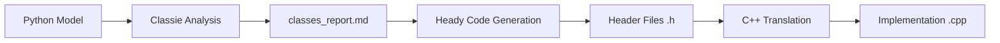

# Agent Configuration

## Objective
Translate Python optimization models (pyomo/gurobipy) to clean, minimal C++ code.

## Core Principles
- **Simplicity over complexity**: Generate only .cpp and .h files
- **Readability first**: Code must be human-reviewable
- **Minimal dependencies**: Avoid unnecessary libraries
- **Consistent style**: Follow supervisor's coding patterns

## Code Structure Requirements

### File Organization
- `model.h`: Class declarations, function prototypes
- `model.cpp`: Implementation
- `function.cpp`: Model building logic
- **Forbidden**: .exe, g++, Makefile, CMakeLists.txt (unless explicitly requested)

### Data I/O Requirements

**Reading Pattern - txt**:
```cpp
ifstream file;
file.open("data\\data.txt");
std::getline(file, line);  // Skip comment lines
file >> temp;              // Read value
```

**Reading Pattern - csv**:
```cpp
ifstream file;
file.open("data\\centers.csv");
for (int i = 0; i < numRows; i++) {
    for (int j = 0; j < numCols; j++) {
        file >> value;
        if (j < numCols - 1) file >> tempchar;  // Skip comma
    }
}
file.close();
```

**Validation Checklist**:
- [ ] No matrix libraries (Eigen, Armadillo) for file reading
- [ ] Derived values computed in code, not read from files
- [ ] Comments preserved in txt using `std::getline()`
- [ ] CSV delimiters handled with `tempchar`

**Code Pattern**:
```cpp
// Wrong: Read pre-calculated value
file >> fixedCost;

// Right: Read base, compute in code
file >> capacity;
hub[i].setfixedCost(capacity * 0.25);
```

See `USER_GUIDE.md` for data preparation specifications.

### Translation Rules
**Variables**:
```cpp
// pyomo: model.x = Var(domain=NonNegativeReals)
IloNumVarArray x(env, n, 0, IloInfinity);
```

**Constraints**:
```cpp
// pyomo: model.c = Constraint(rule=constraint_rule)
IloRangeArray constraints(env);
model.add(constraints);
```

**Objective**:
```cpp
// pyomo: model.obj = Objective(expr=..., sense=minimize)
model.add(IloMinimize(env, objective_expr));
```

## Workflow
1. Analyze Python model structure
2. Generate minimal C++ equivalent
3. Validate compilation and logic
4. Document non-obvious mappings

## Output Checklist
- [ ] Only .cpp/.h files generated
- [ ] Code compiles without warnings
- [ ] Readable by non-AI programmer
- [ ] Data I/O uses readline pattern
- [ ] No unnecessary libraries imported

## C++ Class Design for Nodes

### Why Use Classes
- Encapsulate node attributes (costs, emissions, demand)
- Type safety (different node types don't mix)
- Uniform getter/setter pattern
- Easy to extend with new node types

### Header File Structure
```cpp
#ifndef NODE_H
#define NODE_H

class Node {
public:
    Node() {}
    
    void init(int size1, int size2, int size3) {
        // Allocate 1D arrays
        array1D = new double[size1];
        
        // Allocate 2D arrays
        array2D = new double*[size1];
        for (int i = 0; i < size1; i++) {
            array2D[i] = new double[size2];
        }
        
        // Allocate 3D arrays
        array3D = new double**[size1];
        for (int i = 0; i < size1; i++) {
            array3D[i] = new double*[size2];
            for (int j = 0; j < size2; j++) {
                array3D[i][j] = new double[size3];
            }
        }
    }
    
    // Getters for scalars (single-index attributes)
    int getCapacity() { return capacity; }
    double getVarCost() { return varCost; }
    
    // Getters for arrays (multi-index attributes)
    double get1D(int i) { return array1D[i]; }
    double get2D(int i, int j) { return array2D[i][j]; }
    double get3D(int i, int j, int k) { return array3D[i][j][k]; }
    
    // Setters
    void setCapacity(int v) { capacity = v; }
    void setVarCost(double v) { varCost = v; }
    void set1D(int i, double val) { array1D[i] = val; }
    void set2D(int i, int j, double val) { array2D[i][j] = val; }
    void set3D(int i, int j, int k, double val) { array3D[i][j][k] = val; }
    
    void delArr(int size1, int size2) {
        delete[] array1D;
        
        for (int i = 0; i < size1; i++) {
            delete[] array2D[i];
        }
        delete[] array2D;
        
        for (int i = 0; i < size1; i++) {
            for (int j = 0; j < size2; j++) {
                delete[] array3D[i][j];
            }
            delete[] array3D[i];
        }
        delete[] array3D;
    }
    
    ~Node() {}

private:
    // Single-index: scalar members (attributes of this node only)
    int capacity = 0;
    double varCost = 0.0;
    
    // Multi-index: array members (relationships to other entities)
    double* array1D;    // to destinations
    double** array2D;   // indexed by [destination][attribute]
    double*** array3D;  // indexed by [dest1][dest2][attribute]
};

#endif
```

### Member Design Rules

**Array index represents node identity**:
```cpp
node = new Node[numNodes];  // node[i] is the i-th node
node[i].getCapacity();      // i identifies which node
```

**Scalar vs Array members**:
- **Scalar**: Attribute belongs to this node only (single-index parameter)
  - Example: `capacity`, `varCost`
  - Usage: `node[i].getCapacity()`
- **Array**: Relationship to other entities (multi-index parameter)
  - Example: `trCostToDestination[d]`, `demandMatrix[period][scenario]`
  - Usage: `node[i].getTrCost(d)`

**Rule**: If parameter depends only on current entity → scalar member. If it relates to destinations/periods/scenarios → array member.

### Naming Convention
- Class: `Cities`, `Terminal`
- One .h file per node type
- See `examples/cities.h` for complete reference

## Agent Collaboration: Working with Classie & Heady

### When to Use Agents
Before starting any C++ translation, use the **specialized agent team**:

1. **Classie Agent**: Analyze Python model structure and identify entity classes
2. **Heady Agent**: Generate header files (.h) based on Classie's analysis
3. **Validation**: Review results against project standards

### Specialized Agent Specifications

**Classie Agent Configuration:**
- **Name**: classie (Analyst)
- **Model**: Sonnet
- **Color**: purple
- **Core Function**: Entity identification and pattern recognition
- **Input**: Python optimization code (pyomo/gurobipy)
- **Output**: `classes_report.md` structured analysis

**Classie Analysis Capabilities:**
- **Entity Pattern Recognition**: Identifies arrays sharing indices, DataFrames, dictionaries
- **Logical Entity Detection**: Focuses on nodes, facilities, resources, scenarios
- **Attribute Grouping**: Related parameters that belong to same entity type
- **Validation Rules**: Each class must have ≥2 related attributes, represent logical entity types
- **Output Structure**: Detailed markdown report with scalar/array member classification

**Heady Agent Configuration:**
- **Name**: heady (Code Generator)
- **Model**: Sonnet
- **Color**: blue
- **Core Function**: C++ header file generation
- **Input**: `classes_report.md` from Classie
- **Output**: Clean, compilable .h files

**Heady Code Generation Standards:**
- **Type Selection**: Capacity/Count → int, Costs/Emissions → double, Indices → int
- **Naming Conventions**: Concise but clear (varCost, emsTrToSP, railMaintCostToDry)
- **Variable Organization**: Group related variables with initialization
- **Memory Management**: Pointer initialization to nullptr, complete init/delArr patterns
- **Method Generation**: get/set patterns with consistent parameter naming

### Enhanced Workflow Integration


### How to Use the Agent Team

**Step 1: Analysis Phase (Classie)**
- Provide Python model files to Classie agent
- Classie identifies entity types and their attributes
- Generates structured `classes_report.md` with:
  - Scalar vs Array member classification
  - Rationale for class groupings
  - Global parameters (excluded from classes)
  - Design notes for Heady

**Step 2: Generation Phase (Heady)**
- Heady reads `classes_report.md`
- Applies project coding standards and templates
- Generates clean .h files with:
  - Proper header guards
  - Initialized scalar members (int=0, double=0.0)
  - Safe pointer initialization (nullptr)
  - Complete getter/setter patterns
  - Memory management methods (init/delArr)

**Step 3: Integration Phase**
- Review generated header files
- Validate against Classie's analysis
- Proceed with C++ implementation using generated classes
- Feed back lessons learned for agent improvement

### Agent Communication Interface

**Classie → Heady Interface:**
```markdown
## ClassName
**Scalar Members**: memberName (type) - description
**Array Members**: memberName[arraySize] (type) - description to destinations
**Rationale**: Why these belong together
```

**Validation Checklists:**
- **Classie**: Entity types identified, ≥2 attributes per class, proper indexing patterns
- **Heady**: Header guards, member initialization, getter/setter completeness, memory safety

### Quality Assurance Loop
- If Heady generates incorrect code → Refine Classie's analysis specifications
- If Classie misses entities → Improve pattern recognition rules
- Continuous improvement through structured feedback

### Integration Benefits
- **Consistency**: All classes follow same design patterns and coding standards
- **Efficiency**: No manual class design required
- **Quality**: Automated validation ensures standards compliance
- **Learning**: Both agents improve from each translation case

## Learning
Record translation challenges in `learning_log.md`. Update this file when new patterns emerge.

## Reference Examples
- `cities1.h` - Validated header file template (approved by classie)
- `classes_report.md` - Complete class analysis for stochastic model
- See `.claude/agents/classie.md` for detailed classie capabilities
