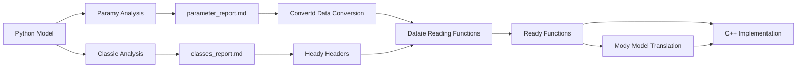

# Agent Configuration

## Objective
Translate Python optimization models (pyomo/gurobipy) to clean, minimal C++ code.

## Core Principles
- **Simplicity**: Generate only .cpp and .h files, no build systems
- **Readability**: Code must be human-reviewable for non-AI programmers
- **Minimal dependencies**: Raw `ifstream` approach, no matrix libraries
- **Base data only**: Store base values in files, compute derived values in C++

## Code Structure Requirements

### File Organization
- `model.h`: Class declarations, function prototypes
- `model.cpp`: Implementation
- `function.cpp`: Model building logic
- **Forbidden**: .exe, g++, Makefile, CMakeLists.txt (unless explicitly requested)

### Data I/O Requirements

**TXT Files** - Configuration parameters with comments:
```cpp
ifstream file;
file.open("data\\data.txt");
std::getline(file, line);  // Skip comment lines
file >> temp;              // Read value
file >> tempDouble; param.setValue(tempDouble / 100);  // Apply scaling
```

**CSV Files** - Tabular data without comments:
```cpp
ifstream file;
file.open("data\\centers.csv");
for (int i = 0; i < numRows; i++) {
    for (int j = 0; j < numCols; j++) {
        file >> value;
        if (j < numCols - 1) file >> tempchar;  // Skip comma
    }
}
```

**Critical Rules**:
- Base values only → files, derived values → C++ calculations
- Use `std::getline()` for comment handling in TXT files
- Use `tempchar` for comma skipping in CSV files
- Windows paths: `"data\\filename.ext"`
- No external libraries (Eigen, Armadillo) for file reading

### Translation Rules
**Variables**:
```cpp
// pyomo: model.x = Var(domain=NonNegativeReals)
IloNumVarArray x(env, n, 0, IloInfinity);
```

**Constraints**:
```cpp
// pyomo: model.c = Constraint(rule=constraint_rule)
IloRangeArray constraints(env);
model.add(constraints);
```

**Objective**:
```cpp
// pyomo: model.obj = Objective(expr=..., sense=minimize)
model.add(IloMinimize(env, objective_expr));
```

## Agent Collaboration Workflow

**Use specialized agents before any C++ translation**:

1. **Paramy** (orange): Analyze Python files for hard-coded values → `parameter_report.md`
2. **Classie** (purple): Identify entity classes and attributes → `classes_report.md`
3. **Convertd** (teal): Convert Python data to C++-compatible formats → `Data_new/ files`
4. **Heady** (blue): Generate header files based on Classie's analysis → `.h files`
5. **Dataie** (green): Generate C++ data reading functions → `function.cpp`
6. **Mody** (green): Translate Pyomo models to CPLEX C++ functions → `model.cpp`
7. **Implementation**: Complete C++ translation using generated components

## Workflow
1. Analyze Python model with Paramy + Classie
2. Convert data formats with Convertd
3. Generate headers with Heady
4. Generate data reading functions with Dataie
5. Generate model logic with Mody
6. Complete C++ implementation
7. Validate compilation and logic

## Output Checklist
- [ ] Only .cpp/.h files generated
- [ ] Code compiles without warnings
- [ ] Readable by non-AI programmer
- [ ] Data I/O uses project patterns
- [ ] No external libraries imported
- [ ] Performance monitoring capabilities included
- [ ] Debug information controllable via code flags
- [ ] Flexible parameter support for scalability testing

## C++ Class Design for Nodes

### Why Use Classes
- Encapsulate node attributes (costs, emissions, demand)
- Type safety (different node types don't mix)
- Uniform getter/setter pattern
- Manual memory management with init/delArr methods

### Header File Structure
```cpp
#ifndef NODE_H
#define NODE_H

class Node {
public:
    Node() {}
    
    void init(int size1, int size2, int size3) {
        // Allocate 1D arrays
        array1D = new double[size1];
        
        // Allocate 2D arrays
        array2D = new double*[size1];
        for (int i = 0; i < size1; i++) {
            array2D[i] = new double[size2];
        }
        
        // Allocate 3D arrays
        array3D = new double**[size1];
        for (int i = 0; i < size1; i++) {
            array3D[i] = new double*[size2];
            for (int j = 0; j < size2; j++) {
                array3D[i][j] = new double[size3];
            }
        }
    }
    
    // Getters for scalars (single-index attributes)
    int getCapacity() { return capacity; }
    double getVarCost() { return varCost; }
    
    // Getters for arrays (multi-index attributes)
    double get1D(int i) { return array1D[i]; }
    double get2D(int i, int j) { return array2D[i][j]; }
    double get3D(int i, int j, int k) { return array3D[i][j][k]; }
    
    // Setters
    void setCapacity(int v) { capacity = v; }
    void setVarCost(double v) { varCost = v; }
    void set1D(int i, double val) { array1D[i] = val; }
    void set2D(int i, int j, double val) { array2D[i][j] = val; }
    void set3D(int i, int j, int k, double val) { array3D[i][j][k] = val; }
    
    void delArr(int size1, int size2) {
        delete[] array1D;
        
        for (int i = 0; i < size1; i++) {
            delete[] array2D[i];
        }
        delete[] array2D;
        
        for (int i = 0; i < size1; i++) {
            for (int j = 0; j < size2; j++) {
                delete[] array3D[i][j];
            }
            delete[] array3D[i];
        }
        delete[] array3D;
    }
    
    ~Node() {}

private:
    // Single-index: scalar members (attributes of this node only)
    int capacity = 0;
    double varCost = 0.0;
    
    // Multi-index: array members (relationships to other entities)
    double* array1D;    // to destinations
    double** array2D;   // indexed by [destination][attribute]
    double*** array3D;  // indexed by [dest1][dest2][attribute]
};

#endif
```

### Member Design Rules

**Array index represents node identity**:
```cpp
node = new Node[numNodes];  // node[i] is the i-th node
node[i].getCapacity();      // i identifies which node
```

**Scalar vs Array members**:
- **Scalar**: Attribute belongs to this node only (single-index parameter)
  - Example: `capacity`, `varCost`
  - Usage: `node[i].getCapacity()`
- **Array**: Relationship to other entities (multi-index parameter)
  - Example: `trCostToDestination[d]`, `demandMatrix[period][scenario]`
  - Usage: `node[i].getTrCost(d)`

**Rule**: If parameter depends only on current entity → scalar member. If it relates to destinations/periods/scenarios → array member.

### Naming Convention

**IMPORTANT**: Always reference `user_preference.md` for specific naming requirements before generating code.

## Specialized Agent Specifications

**Paramy** (orange) - Parameter Analysis:
- Identifies hard-coded values and external data sources in Python files
- Recommends file organization strategy (TXT vs CSV)
- **DOES NOT** list specific parameter values, only categories and strategy
- Output: `parameter_report.md`

**Classie** (purple) - Entity Analysis:
- Identifies entity classes and their attributes from Python model structure
- Groups related parameters into logical classes (≥2 attributes per class)
- Classifies scalar vs array members
- Output: `classes_report.md`

**Convertd** (teal) - Data Format Conversion:
- Converts Python data structures to C++-compatible file formats
- Emphasizes dynamic import and live data extraction (no hard-coding)
- Provides universal file organization strategy and conversion templates
- Output: `Data_new/` folder with C++-compatible files

**Heady** (blue) - Header Generation:
- Generates .h files based on Classie's analysis
- Applies user preference naming conventions
- Creates complete getter/setter patterns with memory management

**Dataie** (green) - Data Reading Functions:
- Generates C++ data reading functions for optimization models
- Provides dynamic network indexing and error-resilient reading patterns
- Ensures compatibility with converted data files and existing class structures
- Output: `function.cpp` with comprehensive data loading

**Mody** (green) - Model Translation:
- Translates Pyomo optimization models to CPLEX C++ functions
- Applies learned patterns from existing C++ implementations
- Generates complete model building logic with constraints
- Output: C++ model functions

## Enhanced Workflow Integration


### Agent Communication Flow
- **Paramy**: Python file → Data organization strategy (no specific values)
- **Classie**: Python structure → Entity class definitions with scalar/array classification
- **Convertd**: Python data structures → C++-compatible files with dynamic extraction
- **Heady**: Classie report → Clean .h files with proper memory management
- **Dataie**: Convertd files + Heady classes → Robust data reading functions
- **Mody**: Pyomo model + Dataie functions → CPLEX C++ implementation

### Quality Assurance
- **Paramy**: Strategy-focused, no value disclosure
- **Classie**: ≥2 attributes per class, logical entity types
- **Convertd**: Dynamic extraction, universal templates, no hard-coding
- **Heady**: Header guards, complete getters/setters, memory safety
- **Dataie**: Dynamic adaptability, error resilience, integration simplicity
- **Mody**: Learned patterns applied, complete memory management

## Learning & References
Record translation challenges in `learning_log.md`. Update this file when new patterns emerge.

**Key Project Insights**:
- C++ performance dramatically outperforms Python (<1s vs 100s+ for model building)
- Base data storage + derived calculations in code = optimal approach
- Consistent file reading patterns ensure maintainability
- **Performance monitoring is essential** for optimization and debugging
- **Flexible parameter control** enables scalability testing and validation
- **Controllable debug output** supports both development and production environments

**File Organization Strategy**:
- **TXT files**: Configuration parameters with comments, mixed data types, unified control
- **CSV files**: Tabular data, scenario matrices, large numerical datasets
- **Derived values**: Always compute in C++ code, never store in files
- **Central configuration**: Single configuration file controlling all model dimensions
- **Flexible data access**: Support for variable scenario/data set sizes

**Performance and Debugging Guidelines**:
- **Include CPU timing**: Use `clock()` for performance monitoring
- **Modular debug control**: Comment out debug sections for production
- **Execution time breakdown**: Track I/O, computation, and optimization separately
- **Memory safety**: Consistent `init()`/`delArr()` patterns with proper cleanup
- **Scalability testing**: Design for different data sizes via parameter control
